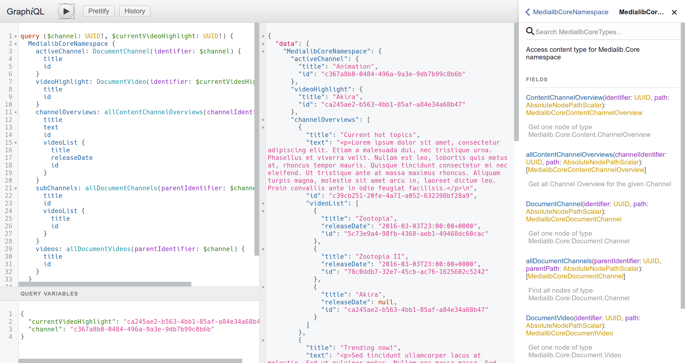

# Headless API for Neos CMS

## Description

_This package is highly experimental, don't use it at home._

Currently this package require a forked version of [wwwision/graphql](https://github.com/dfeyer/Wwwision.GraphQL/tree/task-flexible-typeresolver).
You must use the branch `task-flexible-typeresolver`.

Lots of inspiration and foundation taken from from [Wwwision.Neos.GraphQL](https://github.com/bwaidelich/Wwwision.Neos.GraphQL) and the API
took a lots of inspiration from the Simple API of [GraphCMS](https://graphcms.com/docs/api_simple/).

## Why this package ?

For an internal project, we need to have a flexible distribution for Neos, that allow client to select different features (Package),
each package should register in the API based on basic conventions.



## Goals

The goal of the package is to create a Domain centric GraphQL API. The queries/mutations semantics are automatically
generated from Node Types definitions, but can be customized, and currently look like:

```
query ($parentIdentifier: UUID!) {
	activeChannel: DocumentChannel(identifier: $parentIdentifier) {
	  title
	  id
	}
	subChannels: allDocumentChannels(parentIdentifier: $parentIdentifier) {
	  title
	  id
	}
	videos: allDocumentVideos(parentIdentifier: $parentIdentifier) {
	  title
	  id
	}
	suggestedChannels: allDocumentChannels {
	  title
	  id
	}
}
```

## How to expose your NodeType in the API

You need to use the abstract node type `Ttree.Headless:Queryable` as a super type of your node type. With this 
configuration in place the package create for you, if you have a node type `Your.Package:Document`:
 
 - a query to get a single node `Document`. This query accept `identifier` or `path` and return a single node.
 - a query to get all nodes `allDocuments`. This query accept `parentIdentifier` or `parentPath` and return a collection
 of nodes.

## How to use a custom type ?

You can customize the automatically created query, by registring custom types, edit your `NodeTypes.yaml`:

```yaml
Your.Package:Document:
  options:
    TtreeHeadless:
      fields:
        all:
          implementation: YourPackage\CustomType\AllDocumentCustomType
        single:
          implementation: YourPackage\CustomType\SingleDocumentCustomType
```

You must implement the `CustomFieldInterface`, check `Ttree\Headless\CustomType\AllNodeCustomType` and 
`Ttree\Headless\CustomType\AllNodeCustomType` to learn more.

You can also add some virtual fields or override existing files for a specific Node Type:

```yaml
Medialib.Core:Content.ChannelOverview:
  options:
    Ttree:Headless:
      properties:
        videoList:
          implementation: Medialib\Core\Graphql\CustomType\ContentChannelOverview\VideoListCustomField
```

Virtual fields must implement the `CustomFieldInterface` and `CustomFieldTypeInterface`:

```php
class VideoListCustomField implements CustomFieldInterface, CustomFieldTypeInterface
{
    public function args(TypeResolver $typeResolver): array
    {
        return [];
    }

    public function description(NodeType $nodeType): string
    {
        return 'The video selection with pagination support';
    }

    public function resolve(NodeType $nodeType): \Closure
    {
        return function (AccessibleObject $wrappedNode) {
            /** @var NodeInterface $node */
            $node = $wrappedNode->getObject();

            $query = (new FlowQuery($node->getProperty('selection') ?: []))
                ->find('[instanceof Medialib.Core:Document.Movie]');

            return new IterableAccessibleObject($query->get());
        };
    }

    public function type(TypeResolver $typeResolver, NodeType $nodeType)
    {
        $nodeType = $this->nodeTypeManager->getNodeType('Medialib.Core:Document.Movie');
        $type = $typeResolver->get([Node::class, $nodeType->getName()], $nodeType);
        return Type::listOf($type);
    }
}
```

## System Property

- `id`: the node identifier
- `createdAt`: node creation time
- `updatedAt`: node last modification time

### Roadmap

The initial goal is to have a read only API, the next step will to add mutation support.

#### 1.0

- [x] Automatic query generation based on the node configuration
- [x] Custom type configuration
- [x] Image support
- [ ] Asset(s) support
- [ ] Reference(s) support
- [ ] Pagination support
- [ ] Content Collection support
- [ ] More advanced API, like a good support for Facebook Relay

#### 1.2

- [ ] Management of `Permanent Auth Token` to access to API
- [x] An API to register custom query per node type

#### 2.0

- [ ] Intelligent cache layer with auto flushing
- [ ] Automatic mutations generation based on the node configuration
- [ ] An API to register custom mutation per node type
- [ ] An API to register custom query not directly attached to a node type

#### 3.0

- [ ] Mutation support with fine grained access permissions (CRUD configuration per node type and per property)

### Examples

By example if you use the Neos CMS demo site. This package include a Chapter node type. 

So a query to get a specific chapter should look like this:

```graphql
{
  Chapter(identifier: "6db34628-60c7-4c9a-f6dd-54742816039e") {
    title
    description
    createdAt
    
    # Get all the content of the given collection, recursively
    _collection(path: "main", baseType: "Neos.Neos:Content") {
      _type
      title
      text
    }
    
    # Single image from the node property "image"
    image {
      fileName
      url
      mimeType
      size
    }
    
    # One or more images from the node property "gallery"
    gallery {
      fileName
      url
      mimeType
      size
    }
  }
}
```

To get all chapters:

```graphql
{
  allChapters(limit: 20) {
    title
    description
    createdAt
    
    # Get all the content of the given collection, recursively
    _collection(path: "main", baseType: "Neos.Neos:Content") {
      _type
      title
      text
    }
    
    # Single image from the node property "image"
    image {
      fileName
      url
      mimeType
      size
    }
    
    # One or more images from the node property "gallery"
    gallery {
      fileName
      url
      mimeType
      size
    }
  }
}
```

## Sponsors & Contributors

The development of this package is sponsored by ttree (https://ttree.ch).
